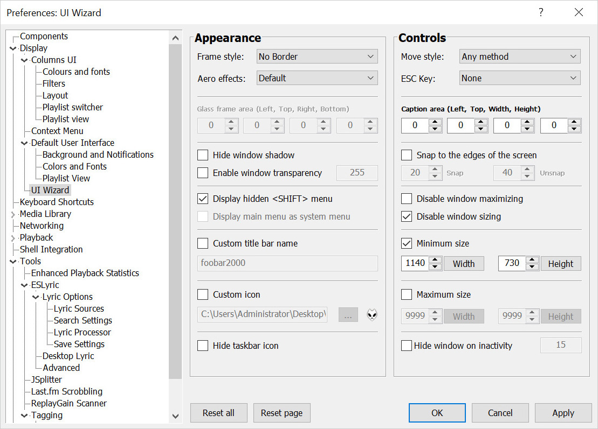
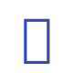

<!-- #region CROWN OF THE SAPPHIRE CHAPTER -->

   
  <picture>
    <source media="(prefers-color-scheme: dark)" srcset="assets/images/UI-Wizard-Logo.svg">
    
  </picture>
   
   

  <h1>
    <picture>
      <source media="(prefers-color-scheme: dark)" srcset="assets/images/UI-Wizard-Title-Dark.svg">
      
    </picture>
  </h1>

  <picture>
    <source media="(prefers-color-scheme: dark)" srcset="assets/images/UI-Wizard-Subtitle-Dark.svg">
    
  </picture>

<!-- #endregion CROWN OF THE SAPPHIRE CHAPTER -->

 
 

<!-- #region CHRONICLES OF THE SAPPHIRE SANCTUM -->

*Sealed within the luminous **Sapphiraz Sanctum**, where ethereal interfaces shimmer in eternal twilight,
the **UI Wizard** is a spellbinding chapter of **The Wizardium**’s grimoire.
Its runic seal, the radiant **ᛋ Sowilo**, yields only to masters of window enchantment, reshaping foobar2000’s
form with mischievous elegance — from glass-like Aero effects to borderless designs that defy mortal UI constraints.*

 

<h3 align="center"><em>⸺ Lux Etherea Imperat ⸺</em></h3>

<a href="https://github.com/The-Wizardium">A Sacred Chapter Of The Wizardium</a>

 
<h2></h2>
 
 

## Arcana Of The Sapphire Spell

 
  <picture>
    <source media="(prefers-color-scheme: dark)" srcset="assets/images/UI-Wizard-Preferences-Dark.jpg">
    
  </picture>
 
 

- **Window Appearance Customization**:
  - Supports multiple frame styles: Default, Small Caption, No Caption, No Border.
  - Configurable Aero effects: Default, Disabled, Glass Frame, Sheet of Glass.
  - Customizable window background color and transparency.
  - Optional custom window title and icon.
  - Configurable window shadow for borderless styles.

- **Window Behavior Control**:
  - Adjustable window positioning and sizing with constraints (min/max width and height).
  - Customizable caption area for dragging with various move styles (e.g., mouse buttons, key combinations).
  - Snap-to-edge functionality with configurable snap and unsnap distances.
  - ESC key actions: None, Hide, or Exit.
  - Inactivity-based window hiding with customizable timeout.

- **Window State Management**:
  - Toggle between Normal, Maximized, and Fullscreen states.
  - Option to disable window maximizing or resizing.
  - Automatic saving and loading of window position and size.

- **API**: COM/ActiveX interface for scripting in foobar2000 via Spider Monkey Panel or JSplitter.

 

## Gather The Relics

- **Conjure** [foobar2000](https://www.foobar2000.org) - The foundational altar
- **Summon** [Spider Monkey Panel](https://github.com/TheQwertiest/foo_spider_monkey_panel) or
  [JSplitter](https://foobar2000.ru/forum/viewtopic.php?t=6378) - For JavaScript communion

 

## Perform The Ritual

01. **Invoke** foobar2000's installation ceremony.
02. **Channel** this sacred chapter from its [Sapphiraz Sanctum](https://github.com/The-Wizardium/UI-Wizard).
03. **Bind** the component to your foobar2000 essence.

 

## Cast The Spell

- **Window Customization**:
  01. Open foobar2000 Preferences.
  02. Navigate to `Display` > `UI Wizard` to configure frame styles, Aero effects, transparency, and more.
  03. Adjust window position, size, and behavior settings via the Preferences dialog.

 

## Enhance The Arcana

For detailed information on the JavaScript API, including usage examples and a complete reference of properties and methods,
see the [API documentation](assets/docs/API.md).

 

## Join The Inner Circle

New Arcane Arts are ever welcome! Prove your mastery:
- **Forge Enhancements**: Submit pull requests to expand this chapter's magic.
- **Reveal Mystical Anomalies**: Open issues to report eldritch bugs.
- **Earn Your Sigil**: Notable contributors will be etched in the Hall of Honorable Scholars.

 

## Hall Of Honorable Scholars

- Peter Pawlowski for [foobar2000](https://www.foobar2000.org), the sacred canvas enchanted with Arcana —
  [oops, Peter, we did it again! 😈](https://www.youtube.com/watch?v=qItugh-fFgg)
- Tsuda Kageyu for [MinHook](https://github.com/TsudaKageyu/minhook).

 

## Sacred Oaths

This holy spell be bound by the sacred oath of the MIT License.

<!-- #endregion CHRONICLES OF THE SAPPHIRE SANCTUM -->

 
 

<!-- #region SECRET INSCRIPTION OF THE ETERNAL BINDING -->

  <h2>
    <picture>
      <source media="(prefers-color-scheme: dark)" srcset="assets/images/UI-Wizard-Footer-Slogan-Dark.svg">
      
    </picture>
  </h2>

  <a href="https://www.the-wizardium.org/index.html#ChroniclesOfTheSealedChapters">Prove Your Worth And Wield The Wizardium’s Sacred Spells</a>

  <a href="#" onclick="window.scrollTo(0, 0);">
    <picture>
      <source media="(prefers-color-scheme: dark)" srcset="assets/images/UI-Wizard-Footer-Rune-Dark.svg">
      
    </picture>
  <a>

<!-- #endregion SECRET INSCRIPTION OF THE ETERNAL BINDING -->
